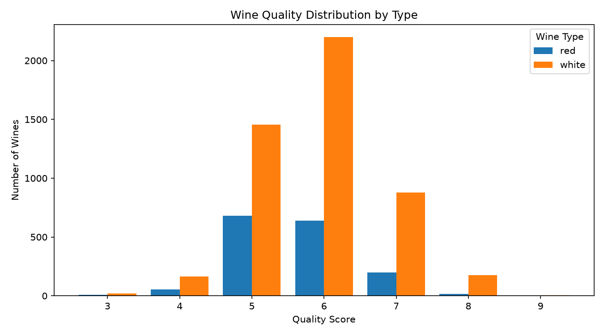
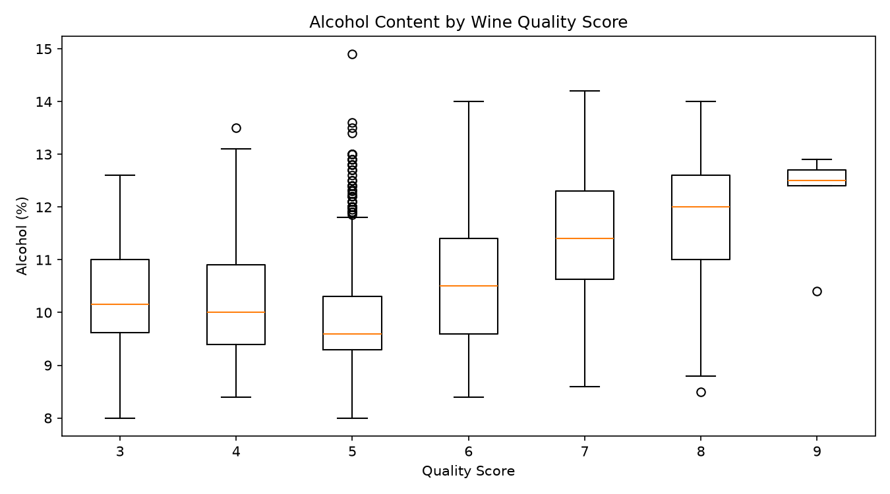
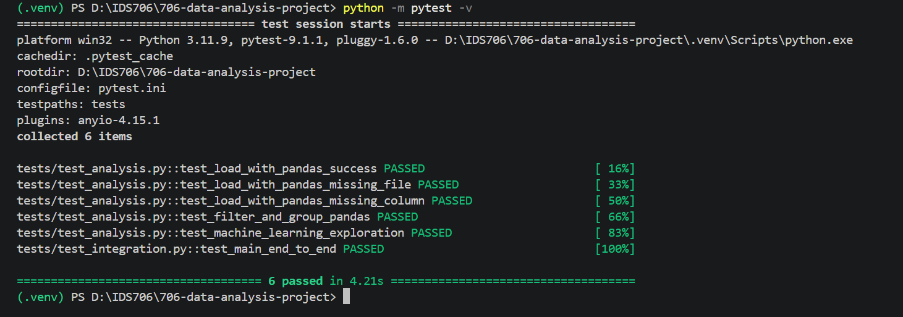
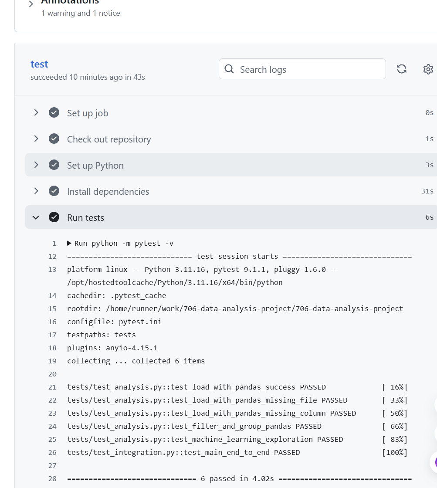

# IDS 706 Data Analysis Project

[](https://github.com/uswanyouxi/706-data-analysis-project/actions/workflows/tests.yml)

> **Refactoring Motto:** “Make it work, then make it better.”

## Project Motivation

The goal of this project is to explore a real-world wine quality dataset using reproducible data analysis practices. The project combines data inspection, transformation, visualization, performance comparison, and introductory machine learning.

In this phase, the project is extended with automated testing and continuous integration to make the analysis more reliable and reproducible.

## Project Goal

The project aims to identify characteristics associated with wine quality, compare patterns between red and white wines, and build a simple regression model for quality prediction. It also aims to ensure that the main analysis workflow can be automatically tested and reproduced.

## Project Question

**What characteristics are associated with higher wine quality, and do red and white wines show different patterns?**

This project uses a merged red-and-white wine quality dataset to practice data import, inspection, filtering, grouping, visualization, Polars, introductory machine learning, automated testing, and continuous integration.

## Dataset

**Dataset:** Red and White Wine Quality  
**File:** `wine_quality_merged.csv`

The dataset contains:

- **6,497 wine samples**
- **13 columns**
- **11 physicochemical features**
- `quality` as the prediction target
- `type` as the wine category (`red` or `white`)

The 11 physicochemical features are:

- fixed acidity
- volatile acidity
- citric acid
- residual sugar
- chlorides
- free sulfur dioxide
- total sulfur dioxide
- density
- pH
- sulphates
- alcohol

The dataset includes **4,898 white wines** and **1,599 red wines**. Quality scores range from **3 to 9**.

## Repository Structure

```text
706-data-analysis-project/
├── .github/
│   └── workflows/
│       └── tests.yml
├── data/
│   └── wine_quality_merged.csv
├── docs/
│   ├── local-tests-passed.png
│   └── github-actions-tests-passed.png
├── notebooks/
│   └── rust_vs_python_intro.ipynb
├── outputs/
│   ├── summary.txt
│   ├── quality_distribution_by_type.png
│   ├── alcohol_by_quality.png
│   ├── grouped_by_type.csv
│   ├── grouped_by_quality.csv
│   ├── grouped_by_type_quality.csv
│   └── linear_regression_coefficients.csv
├── tests/
│   ├── test_analysis.py
│   └── test_integration.py
├── analysis.py
├── pytest.ini
├── README.md
├── requirements.txt
└── .gitignore
```

## Setup

Create a virtual environment:

```powershell
python -m venv .venv
```

Activate it in PowerShell:

```powershell
Set-ExecutionPolicy -Scope Process Bypass
.\.venv\Scripts\Activate.ps1
```

Install the required packages:

```powershell
python -m pip install --upgrade pip
pip install -r requirements.txt
```

Run the project:

```powershell
python analysis.py
```

Run the automated tests:

```powershell
python -m pytest -v
```

## Data Inspection

The script inspects the data using:

- `head()` to display the first five rows
- `shape` to check the dataset dimensions
- `info()` to inspect data types and non-null counts
- `describe()` to calculate numeric summary statistics
- missing-value checks
- duplicate-row checks
- wine-type counts
- quality-score counts

### Inspection Results

- Rows: **6,497**
- Columns: **13**
- Missing values: **0**
- Duplicate rows: **1,177**
- White wines: **4,898**
- Red wines: **1,599**
- Quality range: **3 to 9**
- Most common quality score: **6**
- Mean quality: approximately **5.82**
- Mean alcohol content: approximately **10.49%**

The duplicate rows are reported rather than silently removed so that the original source data remains unchanged during this introductory exploratory analysis.

## Filtering and Grouping

### High-Quality Filter

For this project, a wine is considered **high quality** when:

```python
quality >= 7
```

This produces **1,277 high-quality wines**, which is about **19.66%** of the full dataset.

High-quality wines by type:

- White: **1,060**
- Red: **217**

Because the dataset contains many more white wines than red wines, raw counts should not be interpreted as direct evidence that white wines are inherently better. Within each type, approximately **21.64% of white wines** and **13.57% of red wines** meet the `quality >= 7` threshold in this dataset.

### Grouping by Wine Type

The mean results are:

| Type | Count | Mean Quality | Mean Alcohol | Mean Volatile Acidity | Mean Sulphates |
|---|---:|---:|---:|---:|---:|
| Red | 1,599 | 5.636 | 10.423 | 0.528 | 0.658 |
| White | 4,898 | 5.878 | 10.514 | 0.278 | 0.490 |

In this dataset, white wine has a slightly higher average quality score than red wine.

### Grouping by Quality Score

| Quality | Count | Mean Alcohol | Mean Volatile Acidity | Mean Sulphates |
|---:|---:|---:|---:|---:|
| 3 | 30 | 10.215 | 0.517 | 0.506 |
| 4 | 216 | 10.180 | 0.458 | 0.506 |
| 5 | 2,138 | 9.838 | 0.390 | 0.526 |
| 6 | 2,836 | 10.588 | 0.314 | 0.533 |
| 7 | 1,079 | 11.386 | 0.289 | 0.547 |
| 8 | 193 | 11.679 | 0.291 | 0.512 |
| 9 | 5 | 12.180 | 0.298 | 0.466 |

A clear pattern appears for alcohol: average alcohol content generally increases at higher quality levels, especially from quality 5 through quality 9.

The highest and lowest quality groups contain relatively few observations, so patterns at those extremes should be interpreted cautiously.

## Visualization

The project creates two visualizations.

### 1. Wine Quality Distribution by Type



This plot compares the number of red and white wines across quality scores. Most wines are concentrated around quality scores 5 and 6. Because the dataset contains many more white wines than red wines, the raw bar heights should not be interpreted as a direct comparison of which wine type is better.

### 2. Alcohol Content by Wine Quality Score



This boxplot shows how alcohol content varies across wine quality scores. Alcohol content generally increases as quality increases, especially from quality 5 through quality 8. This supports the grouped analysis, although the extreme quality groups contain relatively few observations.

## Machine Learning Exploration

The project uses **Linear Regression** to predict the numeric `quality` score.

### Inputs

The model uses the physicochemical features plus wine type.

Because `type` is categorical (`red` or `white`), it is converted into a numeric dummy variable using:

```python
pd.get_dummies()
```

The resulting model includes `type_white` as one of the input features.

### Output

```text
quality
```

### Train/Test Split

- Training rows: **5,197**
- Testing rows: **1,300**
- Test size: **20%**
- `random_state=42` is used for reproducibility

### Model Results

- Linear Regression MAE: **0.5644**
- Linear Regression R²: **0.2672**
- Mean-prediction baseline MAE: **0.6691**

The regression model reduces MAE by about **15.65%** relative to the simple mean-prediction baseline on this train/test split.

An MAE of 0.5644 means that the model's predicted quality score is off by about **0.56 quality points on average**.

The R² of 0.2672 indicates that the linear model explains only part of the variation in wine quality. This suggests that wine quality is not fully captured by a simple linear relationship among these variables.

The coefficient table is saved to:

```text
outputs/linear_regression_coefficients.csv
```

Because the features are measured on different scales, coefficient magnitudes should not be treated directly as a feature-importance ranking without additional scaling or analysis.

## Pandas and Polars Comparison

The analysis repeats a similar read, filter, and group workflow in both Pandas and Polars.

Timing over 50 repeated runs in the latest local execution:

- Pandas: **0.290174 seconds**
- Polars: **0.202568 seconds**
- Polars was approximately **1.43× faster** in this run

This dataset is relatively small, so the exact timing can vary across computers and runs. The result should be interpreted as a small empirical comparison rather than a universal claim that one library is always faster.

## Main Findings

The main findings from this exploratory analysis are:

1. The dataset is complete with no missing values, although it contains 1,177 duplicate rows.
2. Most wines have quality scores of 5 or 6.
3. White wines have a slightly higher average quality score than red wines in this dataset.
4. About 19.66% of all wines have quality scores of 7 or higher.
5. Mean alcohol content generally increases as quality score increases.
6. Linear Regression performs better than a simple mean-prediction baseline, but its R² shows that the relationship is only partly linear.
7. Polars was faster than Pandas for the repeated read/filter/group workflow in this particular run.

## Limitations

This is an introductory exploratory project, so several limitations remain:

- Exact duplicate rows are reported but not removed from the source data.
- Wine quality is based on sensory ratings and may contain subjectivity.
- The dataset contains substantially more white wines than red wines.
- The highest and lowest quality scores have relatively small sample sizes.
- Linear Regression assumes linear relationships and may miss more complex patterns.
- The current model is exploratory rather than optimized for production use.

## Testing

The project includes automated tests using `pytest`.

The current test suite contains **6 tests**:

- **5 unit tests** covering data loading, input validation, filtering/grouping, and machine learning
- **1 integration test** covering the complete end-to-end analysis workflow

The tests include important edge cases such as:

- attempting to load a missing data file
- loading a dataset with a missing required column

Run all tests locally with:

```powershell
python -m pytest -v
```

All 6 tests currently pass successfully.

## Continuous Integration

GitHub Actions is configured in:

```text
.github/workflows/tests.yml
```

The workflow automatically runs whenever code is pushed to the repository or a pull request is created.

The CI workflow:

1. checks out the repository
2. sets up Python 3.11
3. installs the dependencies from `requirements.txt`
4. runs the complete test suite with `python -m pytest -v`

The workflow has already completed successfully on GitHub Actions, confirming that the test suite also passes in a clean Linux environment.

## Test and CI Evidence

### Local Test Results

All six automated tests pass successfully in the local development environment.



### GitHub Actions CI Results

The same six tests also pass successfully in the GitHub Actions Linux environment.



## Rust Ownership Experiment

The modified Rust Jupyter notebook is included in the `notebooks` folder. It was run using the Rust kernel and includes experiments with:

- ownership moves
- borrowing
- mutability
- cloning

The notebook also includes intentional compiler errors to demonstrate Rust's ownership and immutability rules, along with my own ownership experiment.

## Repository

GitHub repository: https://github.com/uswanyouxi/706-data-analysis-project

## Author

Shenghuan Wang
