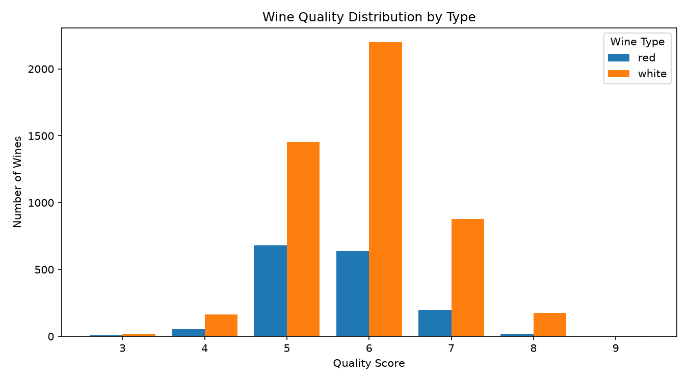
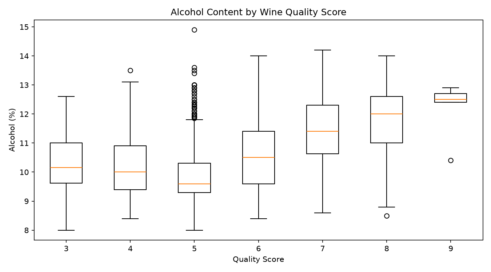
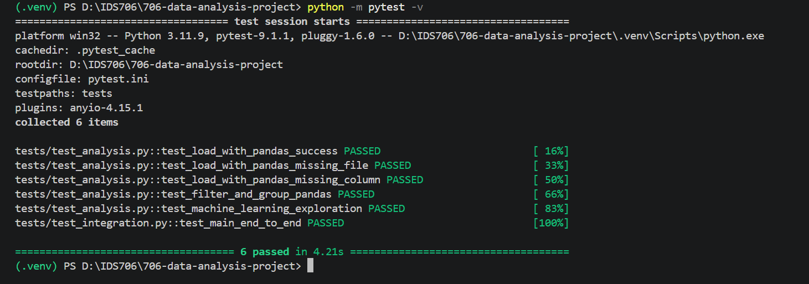
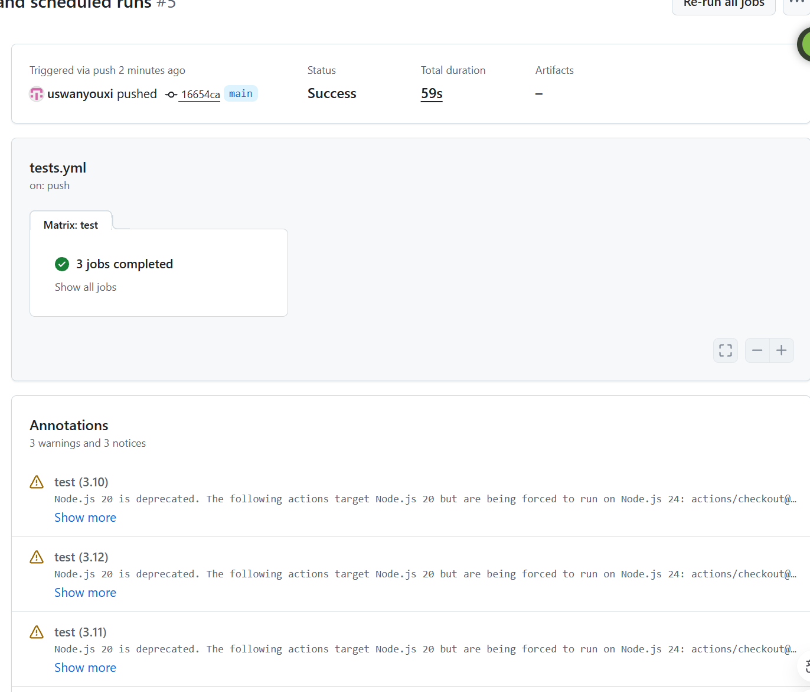
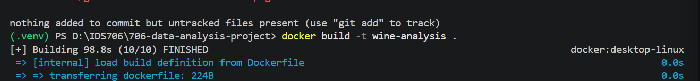
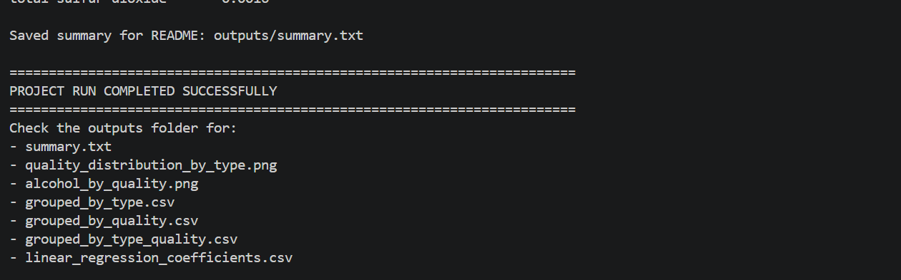
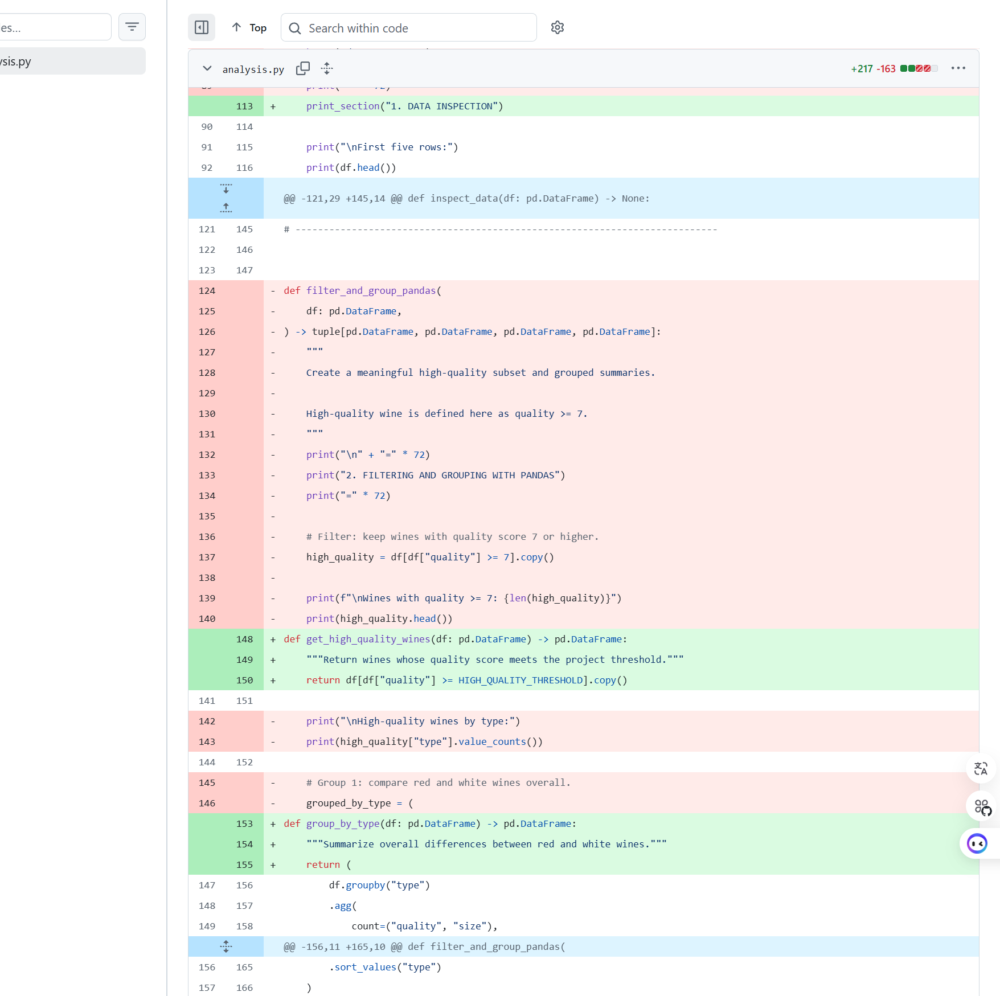
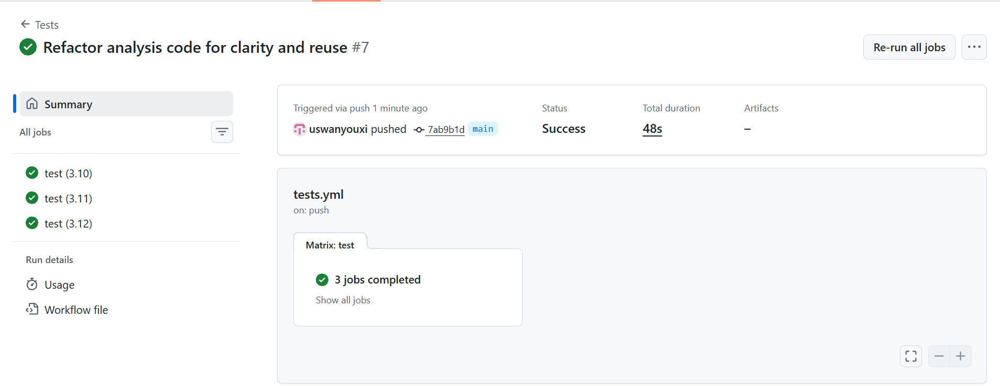

# IDS 706 Data Analysis Project

[](https://github.com/uswanyouxi/706-data-analysis-project/actions/workflows/tests.yml)

> **Refactoring Motto:** Make it work, then make it better.

## Project Overview

This project explores a merged red-and-white wine quality dataset using reproducible data analysis practices. The main question is:

**What characteristics are associated with higher wine quality, and do red and white wines show different patterns?**

The project includes data inspection, data-quality checks, Pandas and Polars analysis, visualization, introductory machine learning, automated testing, CI, Docker, and refactoring.

## Dataset

- **6,497 wine samples**
- **13 columns**
- **11 physicochemical features**
- `quality` is the prediction target
- `type` identifies red or white wine
- **4,898 white wines**
- **1,599 red wines**
- Quality scores range from **3 to 9**

The physicochemical features are fixed acidity, volatile acidity, citric acid, residual sugar, chlorides, free sulfur dioxide, total sulfur dioxide, density, pH, sulphates, and alcohol.

## Data Quality

The dataset contains **no missing values**. It contains **1,177 duplicate rows**. The duplicates are reported but retained so the source data remains unchanged.

Potential outliers are identified with the **1.5 × IQR rule** for selected numeric features. They are retained because unusual chemical measurements may still represent valid wines rather than data-entry errors.

The outlier summary is saved to:

```text
outputs/outlier_summary.csv
```

## Analysis and Key Findings

For this project, a wine is considered high quality when:

```python
quality >= 7
```

This gives **1,277 high-quality wines**, about **19.66%** of the dataset.

### Mean results by wine type

| Type | Count | Mean Quality | Mean Alcohol | Mean Volatile Acidity | Mean Sulphates |
|---|---:|---:|---:|---:|---:|
| Red | 1,599 | 5.636 | 10.423 | 0.528 | 0.658 |
| White | 4,898 | 5.878 | 10.514 | 0.278 | 0.490 |

Main takeaways:

- Most wines have quality scores of **5 or 6**.
- White wines have a slightly higher mean quality score in this dataset.
- Mean alcohol generally increases as quality increases.
- High- and low-quality extremes have relatively small sample sizes, so those groups should be interpreted carefully.
- Because the dataset has many more white wines than red wines, raw counts alone should not be used to claim that one wine type is better.

## Visualizations

### Wine Quality Distribution by Type



This plot compares quality-score counts for red and white wines.

### Alcohol Content by Quality Score



This boxplot shows that alcohol content generally increases at higher quality levels.

## Machine Learning Exploration

A **Linear Regression** model predicts the numeric `quality` score from the physicochemical features and wine type.

- Training rows: **5,197**
- Testing rows: **1,300**
- Test size: **20%**
- `random_state=42`

Results:

- Linear Regression MAE: **0.5644**
- Linear Regression R²: **0.2672**
- Mean-prediction baseline MAE: **0.6691**

The model performs better than the simple mean-prediction baseline on MAE, but the R² shows that a simple linear model explains only part of the variation in wine quality.

The coefficient table is saved to:

```text
outputs/linear_regression_coefficients.csv
```

## Pandas and Polars

The project repeats a similar read/filter/group workflow in Pandas and Polars.

The exact timing changes between runs and machines, so the comparison is treated as a small reproducibility experiment rather than a universal performance claim.

## Testing

The project includes **6 automated tests**:

- 5 unit tests
- 1 end-to-end integration test

The tests cover:

- successful data loading
- missing-file behavior
- missing-column validation
- filtering and grouping
- machine-learning exploration
- the complete analysis workflow

Run locally with:

```powershell
python -m pytest -v
```

Local evidence:



## Continuous Integration

GitHub Actions runs the project checks automatically.

The current workflow includes:

- push runs
- pull-request runs
- manual `workflow_dispatch`
- a weekly scheduled run
- a Python version matrix for **3.10, 3.11, and 3.12**
- Black formatting checks
- Ruff lint checks
- pytest

The workflow is defined in:

```text
.github/workflows/tests.yml
```

Matrix CI evidence:



Earlier successful CI runs are also documented in:

```text
docs/github-actions-3-successful-runs.png
docs/github-actions-tests-passed.png
```

## Docker

The repository includes:

```text
Dockerfile
.dockerignore
```

Build the image:

```powershell
docker build -t wine-analysis .
```

Run the container:

```powershell
docker run --rm wine-analysis
```

The container runs the full analysis workflow and ends with:

```text
PROJECT RUN COMPLETED SUCCESSFULLY
```

Docker build evidence:



Docker run evidence:



### What I learned from Docker

Docker makes the project easier to reproduce because the Python version, dependencies, working directory, and run command are defined in one environment instead of depending on a local machine setup.

## Refactoring and Code Quality

The analysis code was refactored to make the project easier to read, test, and maintain.

Main changes included:

- extracting repeated logic into helper functions
- separating data validation from data loading
- separating filtering, grouping, saving, plotting, benchmarking, and model-preparation responsibilities
- reducing duplication
- improving function names and structure
- keeping the existing project behavior and tests intact

Code quality is checked with:

```powershell
black analysis.py
ruff check analysis.py tests
python -m pytest -v
```

The refactored version still passes all tests and the full CI matrix.

Before-and-after refactoring diff:



Refactoring CI result:



## Setup

Create and activate a virtual environment:

```powershell
python -m venv .venv
Set-ExecutionPolicy -Scope Process Bypass
.\.venv\Scripts\Activate.ps1
```

Install the runtime dependencies:

```powershell
python -m pip install --upgrade pip
pip install -r requirements.txt
```

For development, testing, Black, and Ruff:

```powershell
pip install -r requirements-dev.txt
```

Run the analysis:

```powershell
python analysis.py
```

## Repository Structure

```text
706-data-analysis-project/
├── .github/
│   └── workflows/
│       └── tests.yml
├── data/
│   └── wine_quality_merged.csv
├── docs/
│   ├── docker-build-success.png
│   ├── docker-run-success.png
│   ├── github-actions-3-successful-runs.png
│   ├── github-actions-matrix-success.png
│   ├── github-actions-tests-passed.png
│   ├── local-tests-passed.png
│   ├── refactoring-ci-success.png
│   └── refactoring-diff.png
├── notebooks/
│   └── rust_vs_python_intro.ipynb
├── outputs/
│   ├── alcohol_by_quality.png
│   ├── grouped_by_quality.csv
│   ├── grouped_by_type.csv
│   ├── grouped_by_type_quality.csv
│   ├── linear_regression_coefficients.csv
│   ├── outlier_summary.csv
│   ├── quality_distribution_by_type.png
│   └── summary.txt
├── tests/
│   ├── test_analysis.py
│   └── test_integration.py
├── .dockerignore
├── Dockerfile
├── analysis.py
├── pytest.ini
├── README.md
├── requirements-dev.txt
└── requirements.txt
```

## Limitations

- Duplicate rows are reported but retained.
- Potential IQR outliers are reported but retained.
- The dataset contains many more white wines than red wines.
- Wine quality ratings are subjective.
- Extreme quality scores have relatively small sample sizes.
- Linear Regression may miss nonlinear relationships.
- Pandas/Polars timing results vary across systems and runs.

## Rust Ownership Experiment

The repository also includes `notebooks/rust_vs_python_intro.ipynb`, which contains experiments with Rust ownership, borrowing, mutability, cloning, and intentional compiler errors.

## Repository

GitHub repository: https://github.com/uswanyouxi/706-data-analysis-project

## Author

Shenghuan Wang
